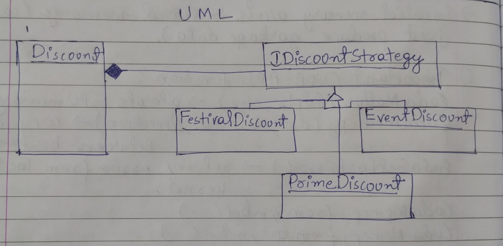

# Assignment1 - Discount Strategy (Open for Extension Principle)

This project objective is to demonstrate the **Open/Closed Principle** using the
**Discount Strategy Pattern** in C#.

It allows new discount types to be added without modifying existing calculation code.

